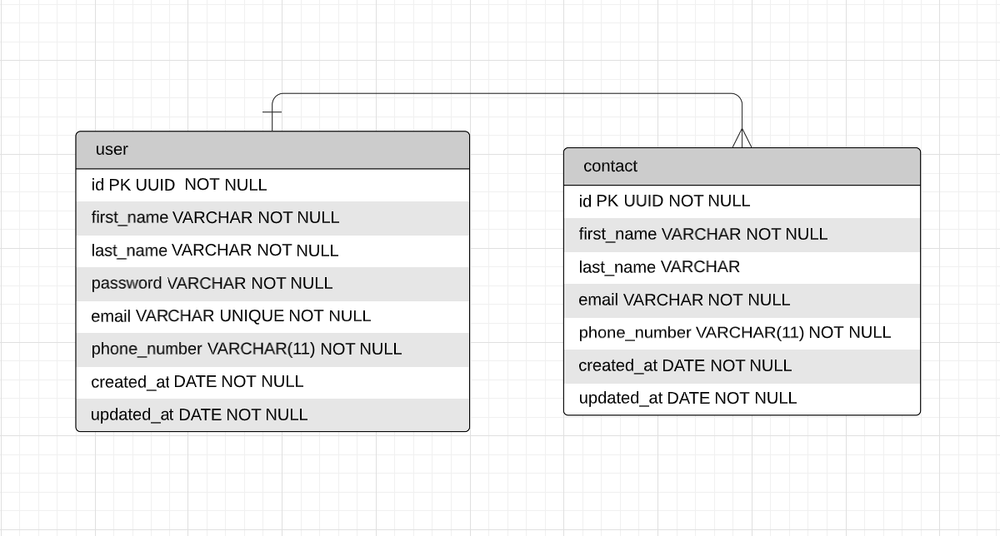

# contact-book-backend

---

## Documentação do projeto

## Tabela de Conteúdos

- [contact-book-backend](#contact-book-backend)
  - [Documentação do projeto](#documentação-do-projeto)
  - [Tabela de Conteúdos](#tabela-de-conteúdos)
  - [1. Descrição do projeto](#1-descrição-do-projeto)
    - [1.1 Diagrama ER](#11-diagrama-er)
    - [1.2 URL base da aplicação](#12-url-base-da-aplicação)
  - [2. Tecnologias utilizadas](#2-tecnologias-utilizadas)
  - [3. Passos de instalação e execução](#3-passos-de-instalação-e-execução)
    - [3.1 Instalando dependências](#31-instalando-dependências)
    - [3.2 Crie um arquivo .env na raiz do projeto](#32-crie-um-arquivo-env-na-raiz-do-projeto)
    - [3.3 Rode as migrations](#33-rode-as-migrations)
    - [3.4 Inicie o servidor localmente](#34-inicie-o-servidor-localmente)
  - [4. Autenticação](#4-autenticação)
  - [5. Endpoints](#5-endpoints)
    - [Índice](#índice)
  - [1. **Users**](#1-users)
    - [Endpoints](#endpoints)
    - [1.1. **Criação de Usuário**](#11-criação-de-usuário)
    - [`/users`](#users)
    - [Exemplo de Request:](#exemplo-de-request)
    - [Corpo da Requisição:](#corpo-da-requisição)
    - [Schema de Validação com Yup:](#schema-de-validação-com-yup)
    - [Exemplo de Response:](#exemplo-de-response)
    - [Possíveis Erros:](#possíveis-erros)
    - [1.2. **Login do usuário**](#12-login-do-usuário)
    - [Exemplo de Request:](#exemplo-de-request-1)
    - [Corpo da Requisição:](#corpo-da-requisição-1)
    - [Exemplo de Response:](#exemplo-de-response-1)
    - [Possíveis Erros:](#possíveis-erros-1)
    - [1.3. **Listando Usuário**](#13-listando-usuário)
    - [`/users`](#users-1)
    - [Exemplo de Request:](#exemplo-de-request-2)
    - [Corpo da Requisição:](#corpo-da-requisição-2)
    - [Exemplo de Response:](#exemplo-de-response-2)
    - [Possíveis Erros:](#possíveis-erros-2)
    - [1.4. **Atualização do usuário**](#14-atualização-do-usuário)
    - [`/users`](#users-2)
    - [Exemplo de Request:](#exemplo-de-request-3)
    - [Corpo da Requisição:](#corpo-da-requisição-3)
    - [Exemplo de Response:](#exemplo-de-response-3)
    - [Possíveis Erros:](#possíveis-erros-3)
    - [1.5 **Delete do usuário**](#15-delete-do-usuário)
    - [`/users`](#users-3)
    - [Exemplo de Request:](#exemplo-de-request-4)
    - [Corpo da Requisição:](#corpo-da-requisição-4)
    - [Exemplo de Response:](#exemplo-de-response-4)
    - [Possíveis Erros:](#possíveis-erros-4)
  - [2. **Contacts**](#2-contacts)
    - [Endpoints](#endpoints-1)
    - [2.1. **Criação de um contato**](#21-criação-de-um-contato)
    - [`/contacts`](#contacts)
    - [Exemplo de Request:](#exemplo-de-request-5)
    - [Corpo da Requisição:](#corpo-da-requisição-5)
    - [Exemplo de Response:](#exemplo-de-response-5)
    - [Possíveis Erros:](#possíveis-erros-5)
    - [2.2. **Listar todos os contatos do usuário**](#22-listar-todos-os-contatos-do-usuário)
    - [`/contacts`](#contacts-1)
    - [Exemplo de Request:](#exemplo-de-request-6)
    - [Corpo da Requisição:](#corpo-da-requisição-6)
    - [Exemplo de Response:](#exemplo-de-response-6)
    - [Possíveis Erros:](#possíveis-erros-6)
    - [2.3. **Atualizar dados do contato**](#23-atualizar-dados-do-contato)
    - [`/contacts`](#contacts-2)
    - [Exemplo de Request:](#exemplo-de-request-7)
    - [Corpo da Requisição:](#corpo-da-requisição-7)
    - [Schema de Validação com Yup:](#schema-de-validação-com-yup-1)
    - [Exemplo de Response:](#exemplo-de-response-7)
    - [Possíveis Erros:](#possíveis-erros-7)
    - [2.4. **Delete do contact**](#24-delete-do-contact)
    - [`/contact`](#contact)
    - [Exemplo de Request:](#exemplo-de-request-8)
    - [Corpo da Requisição:](#corpo-da-requisição-8)
    - [Exemplo de Response:](#exemplo-de-response-8)
    - [Possíveis Erros:](#possíveis-erros-8)

---

## 1. Descrição do projeto

[ Voltar para o topo ](#tabela-de-conteúdos)

O projeto possui um CRUD de usuários que podem conter muitos contatos associados, onde usuários autenticados e com permissão podem acessar o CRUD dos seus contatos associados.

### 1.1 Diagrama ER

Diagrama ER da API definindo bem as relações entre as tabelas do banco de dados.



### 1.2 URL base da aplicação

http://localhost:3333

---

## 2. Tecnologias utilizadas

[ Voltar para o topo ](#tabela-de-conteúdos)

- TypeScript
- NodeJs
- Express
- TypeORM
- PostgreSQL
- yup
- jsonwebtoken
- bcrypt
- cors

---

## 3. Passos de instalação e execução

Certifique que você já criou uma database postgreSQL para o projeto

### 3.1 Instalando dependências

Clone o projeto em sua máquina e instale as dependências no projeto:

```
yarn
```

### 3.2 Crie um arquivo .env na raiz do projeto

Copie o formato do arquivo .env.example para o arquivo .env e preencha as variáveis, exemplo:

```
SECRET_KEY="sua_chave_secreta"
```

Preencha todas as variáveis

### 3.3 Rode as migrations

Crie as tabelas no banco de dados com o comando:

```
yarn typeorm migration:run -d src/database/index.ts
```

### 3.4 Inicie o servidor localmente

```
yarn dev
```

**Após iniciar o servidor localmente você pode testar algumas rotas no link do frontend da aplicação que está logo abaixo:**

[https://contact-book-lac.vercel.app/landingpage](https://contact-book-lac.vercel.app/landingpage)

**Ou testar no Insomnia fazendo o dowload da coleção:**
[Link da coleção](https://drive.google.com/file/d/1LT5LT5xpyszs8MuC09kiUxq31ZPRjoSF/view?usp=sharing)

---

## 4. Autenticação

[ Voltar para o topo ](#tabela-de-conteúdos)

```
Authorization: Bearer token
```

---

## 5. Endpoints

[ Voltar para o topo ](#tabela-de-conteúdos)

### Índice

- [Users](#1-users)
  - [POST - /users](#11-criação-de-usuário)
  - [POST - /login](#12-login-do-usuário)
  - [GET - /users](#13-listando-usuário)
  - [PATCH - /users](#14-atualização-do-usuário)
  - [DELETE - /users](#15-delete-do-usuário)
- [Pets](#2-contacts)
  - [POST - /pets](#21-criação-de-um-contato)
  - [GET - /pets](#22-listar-todos-os-contatos-do-usuário)
  - [PATCH - /pets/:id](#23-atualizar-dados-do-contato)
  - [DELETE - /pets/:id](#24-delete-do-contact)

---

## 1. **Users**

[ Voltar para os Endpoints ](#5-endpoints)

O objeto User é definido como:

| Campo        | Tipo   | Descrição                                 |
| ------------ | ------ | ----------------------------------------- |
| id           | string | Identificador único do usuário.           |
| first_name   | string | O nome do usuário.                        |
| last_name    | string | O sobrenome do usuário.                   |
| phone_number | string | O número do telefone do usuário.          |
| email        | string | O e-mail do usuário.                      |
| password     | string | A senha de acesso do usuário.             |
| created_at   | date   | Data de cadastro do usuário.              |
| updated_at   | date   | Data de atualização do perfil do usuário. |

### Endpoints

| Método | Rota   | Descrição                  |
| ------ | ------ | -------------------------- |
| POST   | /users | Criação de um usuário.     |
| POST   | /login | Login do usuário.          |
| GET    | /users | Lista o usuário.           |
| PATCH  | /users | Atualiza dados do usuário. |
| DELETE | /users | Delete o usuário.          |

---

### 1.1. **Criação de Usuário**

[ Voltar para os Endpoints ](#5-endpoints)

### `/users`

### Exemplo de Request:

```
POST /users
Host: http://localhost:3333
Authorization: None
Content-type: application/json
```

### Corpo da Requisição:

```json
{
  "first_name": "José",
  "last_name": "Silva",
  "email": "jose@mail.com",
  "phone_number": "81992456735",
  "password": "1234"
}
```

### Schema de Validação com Yup:

```javascript
  first_name: yup.string().required(),
  last_name: yup.string().required(),
  phone_number: yup.string().required().length(11),
  email: yup
    .string()
    .email()
    .required()
    .transform((value: string, originalValue: string) => {
      return originalValue.toLowerCase();
    }),
  password: yup
    .string()
    .required()
    .transform((value: string, originalValue: string) => {
      return bcrypt.hashSync(originalValue, 10);
    }),
```

OBS.: Chaves não presentes no schema serão removidas.

### Exemplo de Response:

```
201 Created
```

```json
{
  "id": "22f55f79-0a33-4af5-b7fb-f20e41c1ceed",
  "first_name": "José",
  "last_name": "Silva",
  "email": "adm@mail.com",
  "phone_number": "81992456735",
  "created_at": "2022-11-04T16:13:46.493Z",
  "updated_at": "2022-11-04T16:13:46.493Z"
}
```

### Possíveis Erros:

| Código do Erro  | Descrição             |
| --------------- | --------------------- |
| 400 Bad request | Email already exists. |

---

### 1.2. **Login do usuário**

[ Voltar aos Endpoints ](#5-endpoints)

### Exemplo de Request:

```
POST /login
Host: http://localhost:3333
Authorization: None
Content-type: application/json
```

### Corpo da Requisição:

```json
{
  "email": "jose@mail.com",
  "password": "1234"
}
```

### Exemplo de Response:

```
200 OK
```

```json
[
  {
    "token": "token-de-login"
  }
]
```

### Possíveis Erros:

| Código do Erro  | Descrição                   |
| --------------- | --------------------------- |
| 400 Bad request | email/password is required. |
| 403 forbidden   | Wrong email/password.       |

---

### 1.3. **Listando Usuário**

[ Voltar aos Endpoints ](#5-endpoints)

### `/users`

### Exemplo de Request:

```

GET /users
Host: http://localhost:3333
Authorization: Bearer Token
Content-type: application/json

```

### Corpo da Requisição:

```json
Vazio
```

### Exemplo de Response:

```
200 OK
```

```json
{
  "id": "22f55f79-0a33-4af5-b7fb-f20e41c1ceed",
  "first_name": "José",
  "last_name": "Silva",
  "email": "adm@mail.com",
  "phone_number": "81992456735",
  "created_at": "2022-11-04T16:13:46.493Z",
  "updated_at": "2022-11-04T16:13:46.493Z"
}
```

### Possíveis Erros:

Nenhum, o máximo que pode acontecer é retornar uma lista vazia.

---

### 1.4. **Atualização do usuário**

[ Voltar aos Endpoints ](#5-endpoints)

### `/users`

```
Pode ser atualizado o first_name, last_name, phone_number, email e password todos de uma vez ou parcialmente.
```

### Exemplo de Request:

```
PATCH /users
Host: http://localhost:3333
Authorization: Bearer token
Content-type: application/json

```

### Corpo da Requisição:

```json
{
  "first_name": "Marcos",
  "last_name": "Silva",
  "email": "marcos@mail.com",
  "password": "12345"
}
```

### Exemplo de Response:

```
200 OK
```

```json
{
  "message": "User updated.",
  "user": {
    "id": "61771037-62c9-4d99-8e24-9d8daf46747f",
    "first_name": "Marcos",
    "last_name": "Silva",
    "email": "marcos@mail.com",
    "phone_number": "81992486026",
    "created_at": "2023-02-05T04:18:36.261Z",
    "updated_at": "2023-02-05T12:16:34.398Z"
  }
}
```

### Possíveis Erros:

| Código do Erro   | Descrição                    |
| ---------------- | ---------------------------- |
| 400 Bad request  | missing authorization token. |
| 400 unauthorized | Email already exists.        |
| 403 forbidden    | Invalid token.               |
| 404 not found    | User not found.              |

---

### 1.5 **Delete do usuário**

[ Voltar aos Endpoints ](#5-endpoints)

### `/users`

### Exemplo de Request:

```

DELETE /users
Host: http://localhost:3333
Authorization: Bearer token
Content-type: application/json

```

### Corpo da Requisição:

```json
Vazio
```

### Exemplo de Response:

```
204 OK
```

```json
Vazio
```

### Possíveis Erros:

| Código do Erro  | Descrição                    |
| --------------- | ---------------------------- |
| 400 Bad request | missing authorization token. |
| 403 forbidden   | Invalid token.               |
| 404 not found   | User not found.              |

---

## 2. **Contacts**

[ Voltar para os Endpoints ](#5-endpoints)

O objeto User é definido como:

| Campo        | Tipo    | Descrição                      |
| ------------ | ------- | ------------------------------ |
| id           | string  | Identificador único do contato |
| first_name   | string  | O nome do contato              |
| last_name    | string  | Sobrenome do contato           |
| phone_number | Boolean | Número do contato              |
| email        | date    | Email do contato               |
| created_at   | date    | Data de cadastro do contato    |
| updated_at   | date    | Data de atualização do contato |

### Endpoints

| Método | Rota          | Descrição                          |
| ------ | ------------- | ---------------------------------- |
| POST   | /contacts     | Criação de um contato              |
| GET    | /contacts     | Lista todos os contatos do usuário |
| PATCH  | /contacts/:id | Atualiza um contato                |
| DELETE | /contacts/:id | Delete o contato                   |

---

### 2.1. **Criação de um contato**

[ Voltar para os Endpoints ](#5-endpoints)

### `/contacts`

### Exemplo de Request:

```
POST /contacts
Host: http://localhost:3333
Authorization: Bearer token
Content-type: application/json
```

### Corpo da Requisição:

```json
{
  "first_name": "João",
  "last_name": "Kleber",
  "email": "joao@mail.com",
  "phone_number": "81998877665"
}
```

### Exemplo de Response:

```
201 Created
```

```json
{
  "id": "39da089e-a176-491b-b31c-b03a4b5eb655",
  "first_name": "João",
  "last_name": "Kleber",
  "phone_number": "81998877665",
  "email": "joao@mail.com",
  "created_at": "2023-02-06T02:15:31.411Z",
  "updated_at": "2023-02-06T02:15:31.411Z",
  "owner_id": "c9666585-a796-469f-a772-b970054d9359"
}
```

### Possíveis Erros:

| Código do Erro  | Descrição                    |
| --------------- | ---------------------------- |
| 400 Bad request | missing authorization token. |
| 400 Bad request | User not found.              |
| 403 forbidden   | Invalid token.               |

---

### 2.2. **Listar todos os contatos do usuário**

[ Voltar para os Endpoints ](#5-endpoints)

### `/contacts`

### Exemplo de Request:

```
GET /contacts
Host: http://localhost:3333
Authorization: Bearer Token
Content-type: application/json
```

### Corpo da Requisição:

```json
Vazio
```

### Exemplo de Response:

```
200 Ok
```

```json
[
  {
    "id": "39da089e-a176-491b-b31c-b03a4b5eb655",
    "first_name": "João",
    "last_name": "Kleber",
    "email": "a@mail.com",
    "phone_number": "81993363363",
    "created_at": "2023-02-06T02:15:31.411Z",
    "updated_at": "2023-02-06T02:15:31.411Z"
  }
]
```

### Possíveis Erros:

Nenhum, o máximo que pode acontecer é retornar uma lista vazia.

---

### 2.3. **Atualizar dados do contato**

[ Voltar para os Endpoints ](#5-endpoints)

### `/contacts`

```
Pode ser atualizado o first_name, last_name, phone_number e email todos de uma vez ou parcialmente.
```

### Exemplo de Request:

```
PATCH /contacts/:id
Host: http://localhost:3333
Authorization: Bearer token
Content-type: application/json
```

### Corpo da Requisição:

```json
{
  "first_name": "Moisés",
  "last_name": "Azevedo"
}
```

### Schema de Validação com Yup:

```javascript
  first_name: yup.string().notRequired(),
  last_name: yup.string().notRequired(),
  phone_number: yup.string().length(11).notRequired(),
  email: yup.string().email().notRequired().transform((value:string, originalValue:string)=> {
    return originalValue.toLowerCase()
  })
```

OBS.: Chaves não presentes no schema serão removidas.

### Exemplo de Response:

```
200 Ok
```

```json
{
  "message": "Updated contact.",
  "contact": {
    "id": "6cd125de-b47d-4930-b6e2-25849bf516c6",
    "first_name": "Moisés",
    "last_name": "Azevedo",
    "email": "moises@mail.com",
    "phone_number": "81992486026",
    "created_at": "2023-02-05T13:03:59.048Z",
    "updated_at": "2023-02-05T13:09:20.540Z",
    "owner_id": "a383794c-b98e-429a-987c-c766cf7f8a5e"
  }
}
```

### Possíveis Erros:

| Código do Erro  | Descrição                    |
| --------------- | ---------------------------- |
| 400 Bad request | missing authorization token. |
| 400 not found   | Invalid UUID (contact id)    |
| 403 forbidden   | Invalid token.               |
| 404 not found   | Contact not found.           |

---

### 2.4. **Delete do contact**

[ Voltar aos Endpoints ](#5-endpoints)

### `/contact`

### Exemplo de Request:

```

DELETE /contacts/:id
Host: http://localhost:3333
Authorization: Bearer token
Content-type: application/json

```

### Corpo da Requisição:

```json
Vazio
```

### Exemplo de Response:

```
204 OK
```

```json
Vazio
```

### Possíveis Erros:

| Código do Erro  | Descrição                    |
| --------------- | ---------------------------- |
| 400 Bad request | missing authorization token. |
| 400 not found   | Invalid UUID (contact id)    |
| 403 forbidden   | Invalid token.               |
| 404 not found   | Contact not found.           |

---
